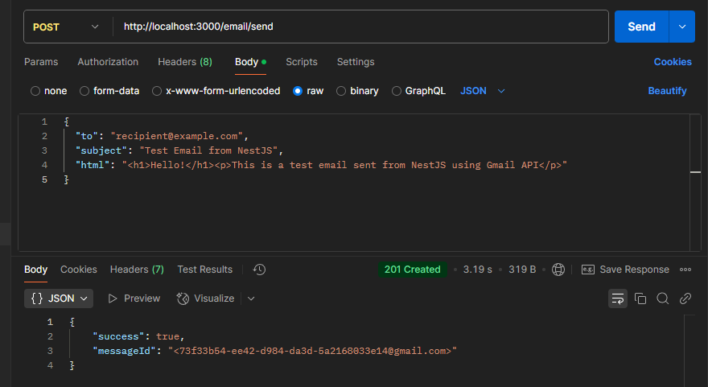
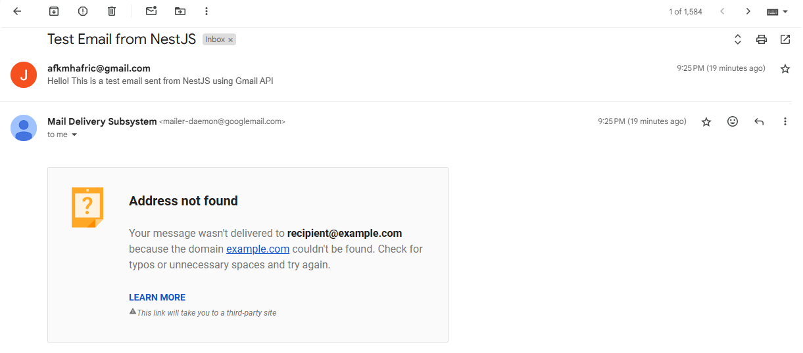

<p align="center">
  <a href="http://nestjs.com/" target="blank"></a>
</p>

[circleci-image]: https://img.shields.io/circleci/build/github/nestjs/nest/master?token=abc123def456
[circleci-url]: https://circleci.com/gh/nestjs/nest

  <p align="center">A progressive <a href="http://nodejs.org" target="_blank">Node.js</a> framework for building efficient and scalable server-side applications.</p>
    <p align="center">
<a href="https://www.npmjs.com/~nestjscore" target="_blank"></a>
<a href="https://www.npmjs.com/~nestjscore" target="_blank"></a>
<a href="https://www.npmjs.com/~nestjscore" target="_blank"></a>
<a href="https://circleci.com/gh/nestjs/nest" target="_blank"></a>
<a href="https://discord.gg/G7Qnnhy" target="_blank"></a>
<a href="https://opencollective.com/nest#backer" target="_blank"></a>
<a href="https://opencollective.com/nest#sponsor" target="_blank"></a>
  <a href="https://paypal.me/kamilmysliwiec" target="_blank"></a>
    <a href="https://opencollective.com/nest#sponsor"  target="_blank"></a>
  <a href="https://twitter.com/nestframework" target="_blank"></a>
</p>
  <!--[](https://opencollective.com/nest#backer)
  [](https://opencollective.com/nest#sponsor)-->

## Description

[Nest](https://github.com/nestjs/nest) framework TypeScript starter repository.

## Project setup

```bash
$ npm install
```

## ⚠️ IMPORTANT: Environment Variables ⚠️

After setting up your Gmail API credentials, you will create a `.env` file to store sensitive information.

**NEVER COMMIT YOUR .ENV FILE TO GIT!**

Make sure to add `.env` to your `.gitignore` file immediately:

```bash
# Add .env to .gitignore
echo ".env" >> .gitignore
```

This file will contain API keys and credentials that should remain private.

## Compile and run the project

```bash
# development
$ npm run start

# watch mode
$ npm run start:dev

# production mode
$ npm run start:prod
```

## Gmail API Setup

To set up the Gmail API for this project:

1. Follow this guide to create and configure your Gmail API credentials:
   https://docs.google.com/document/d/1VkS4XPdFY7aJB_nv92-ieP4QkJcC_ZQEhgxf2Bfpe28/edit?usp=sharing

2. Create an app password for Gmail by following this tutorial:
   https://www.youtube.com/watch?v=hXiPshHn9Pw

## Example Usage

After running the application, you can test it with the following example:

### Example POST Request:



### Results(not found because the recipient was @example.com):



